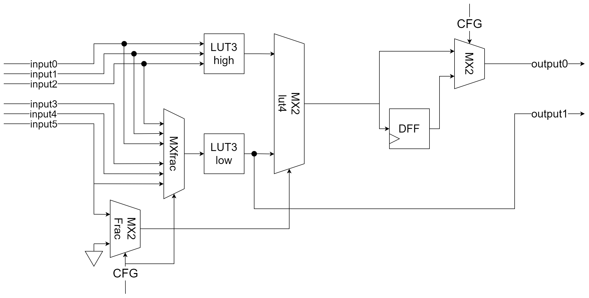
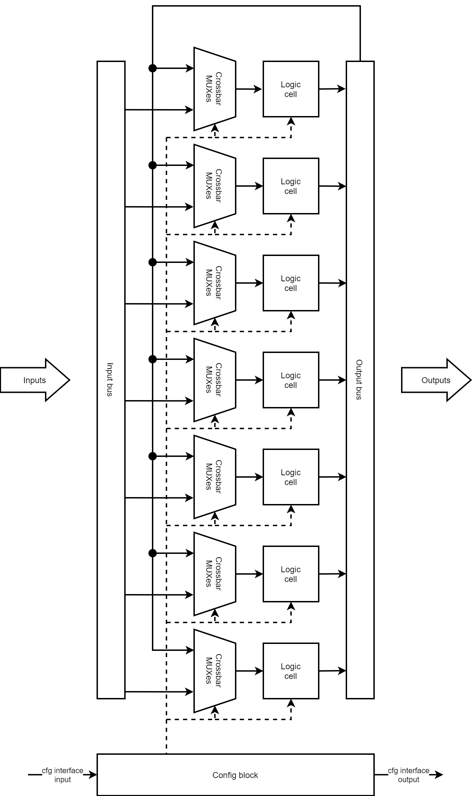
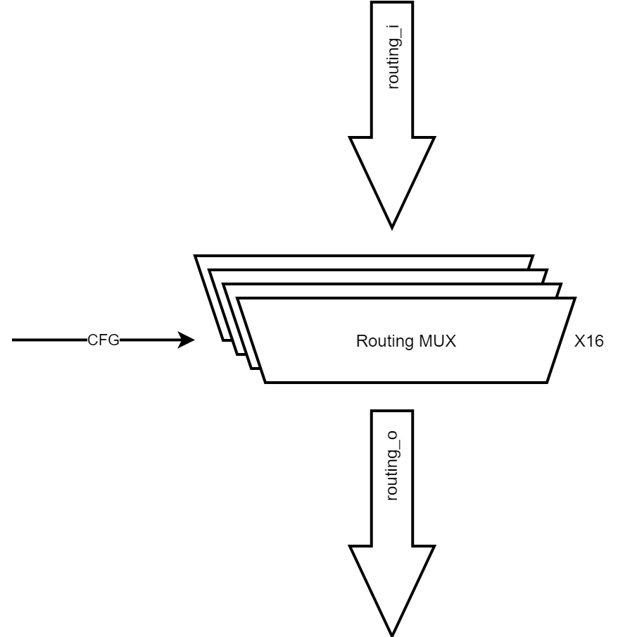
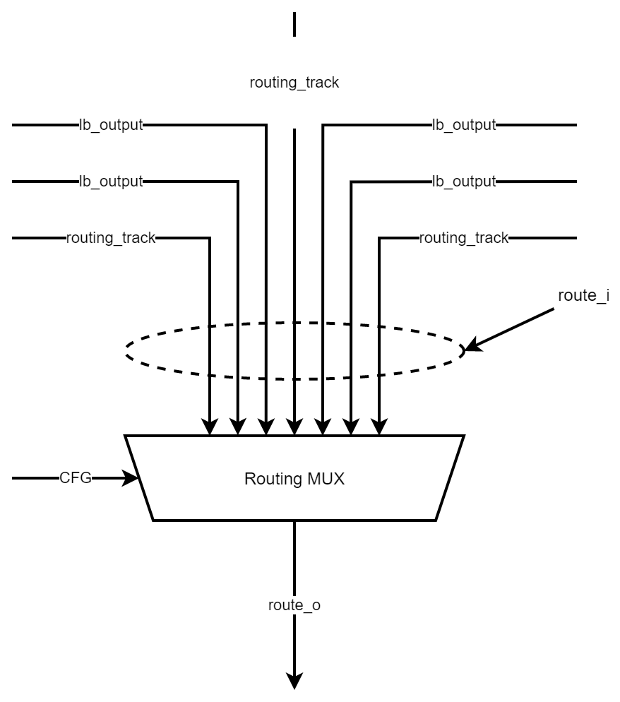

""""""""""""""""""""""""""""""""""
Uranus FPGA
""""""""""""""""""""""""""""""""""

.. contents:: Overview
   :depth: 3

===================
General description
===================

**Documentation development in progress**

===================
Installation
===================

===================
Quick start guide
===================

===================
FPGA structure
===================

--------------------
Logic Cell
--------------------

Uranus FPGA logic 6-input cell contains fracturable LUT4 and one D-flip flop. First logic cell output (output0) can be synchronous or asynchronous (selecting by MX2). Scecond output is used for LUT3 low asynchronous output in fracturable LUT operation mode of logic cell. It is worth noting, that in fracturable mode each LUT3 has independent inputs.

Uranus FPGA logic cell structure

Logic cell config register maping:

+-----------------+--------------+---------+----------+
| 17              | 16           | 15:8    | 7:0      |
+=================+==============+=========+==========+
| frac(1-enabled) | MX2(0-async) | LUT low | LUT high |
+-----------------+--------------+---------+----------+

--------------------
Logic Block
--------------------

Uranus FPGA uses configurable logic block. Each block contains **N** logic cells, **N** crossbar MUXes for internal interconnect, **K** inputs and **2*N** outputs. Configuration block for all block devices is also located here.

Each crossbar MUX can connect every logic cells output or some of inputs with one of logic cell inputs. We usually use 8 logic cell per one longic block and every fourth input goes to crossbar MUX.

Config block is a simple shift register, that receives config data from input interface and pop it to the next logic block. Configuration is completed when all config shift register chain if filled.

Structure of Uranus FPGA logic block
 
--------------------
Routing Node
--------------------

Routing node consists of several routing MUXes, that connects routing tracks and logic block outputs to next routing tracks.

Uranus FPGA routing node

Uranus FPGA routing MUX

--------------------
Clock nets
--------------------

--------------------
Configuration memory
--------------------

========================
Firmware generation flow
========================
